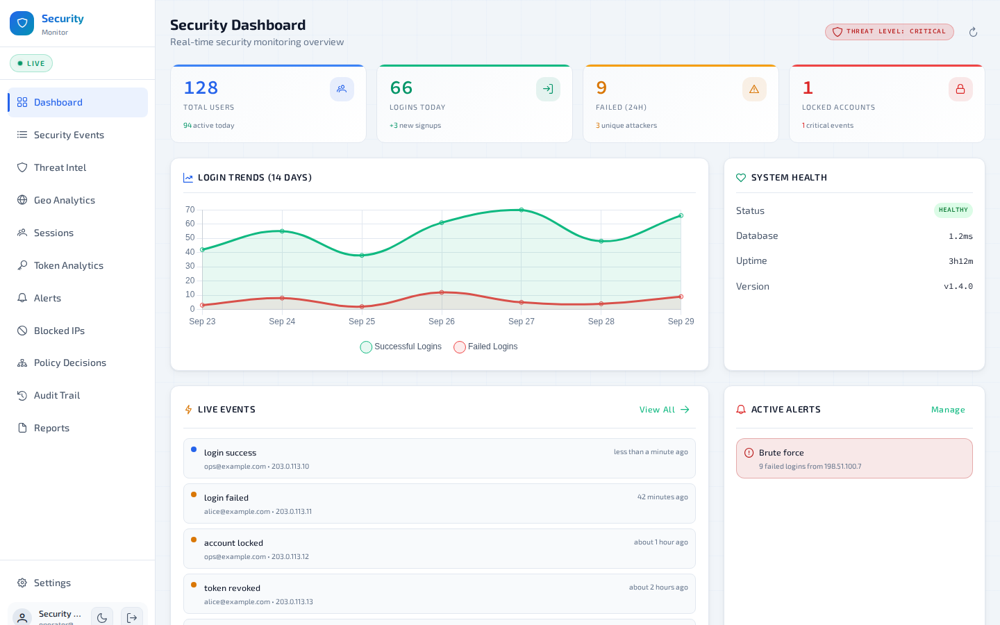
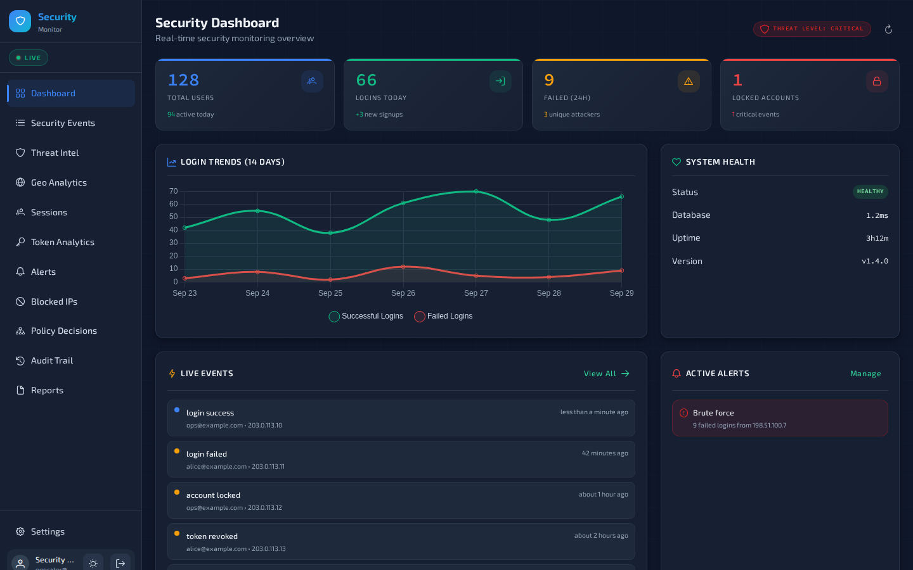

# Socrate monitoring console

> Watch what your identity provider is doing, live, without putting a token in the browser.

The Socrate monitoring console is the security operations dashboard of the Socrate suite. It shows
the live stream of security events from Socrate, the suite's OAuth 2.1 / OpenID Connect server
(`ovander/go-oauth2`, not public yet): sign-ins, token grants, anomalies and access-policy
decisions, and it lets operators act on them by blocking IP addresses, managing alert rules and
reviewing audit logs. It is a Vue 3 single-page application with a small Go Backend-for-Frontend
(BFF) that holds the OAuth tokens server-side. It is for the people who run a Socrate deployment
and need to see, and stop, what is happening to it.

---

## Table of contents

- [Why a separate console](#why-a-separate-console)
- [Features](#features)
- [Screenshots](#screenshots)
- [Tech stack](#tech-stack)
- [Architecture](#architecture)
- [Project structure](#project-structure)
- [Getting started](#getting-started)
- [Environment variables](#environment-variables)
- [Testing](#testing)
- [Deployment](#deployment)
- [Security posture](#security-posture)
- [Status](#status)

---

## Why a separate console

A monitoring console for an identity provider is itself a target: whoever controls it can read
the security log and block or unblock traffic. Browser-based dashboards usually keep an access
token in JavaScript, where one XSS or one poisoned dependency is enough to steal it and replay it
against the admin API.

This console removes that class of attack. The browser holds only an opaque, `HttpOnly` session
cookie; the BFF runs the OAuth flow, keeps the tokens and is the only client of Socrate's
loopback-only admin API. The design is recorded in
[ADR-0001](docs/adr/0001-backend-for-frontend.md).

---

## Features

- **Live event stream**: a Server-Sent Events feed of sign-ins, token grants, revocations and
  anomalies, with a live indicator and automatic reconnection.
- **Threat dashboard**: at-a-glance statistics, threat level, recent events and charts.
- **Investigation views**: events, threats, active sessions, issued tokens, reports, a
  geographic view and the access-policy decision log.
- **Operator actions**: alert rules, blocked IP addresses, audit logs and settings, for admins
  only.
- **Viewer and admin roles**: viewers get the read-only views; admin routes and destructive
  buttons need an admin role. The role lists are set at build time.
- **Step-up for destructive actions**: a recent re-authentication, performed through the BFF
  (`/bff/elevate`); the elevated token stays server-side.
- **Light and dark theme**: light by default on first visit, following the system setting, with
  a sun/moon toggle in the sidebar. The choice is remembered in a `theme` preference cookie, not
  in browser storage, and the charts follow the theme.
- **No tokens in the browser**: the SPA calls the API same-origin with a session cookie and
  never sends an `Authorization` header.
- **Version badge and stale-tab detection**: the sidebar shows the console and Socrate server
  versions, and the console polls the server version every five minutes and offers a refresh when
  a new release has been deployed (`useVersionCheck.ts`).

---

## Screenshots

| Light | Dark |
|---|---|
|  |  |

Rendered from the production build with sample data.

---

## Tech stack

| Concern | Library / version |
|---|---|
| Framework | Vue 3.5 (Composition API, `<script setup>`), TypeScript 5.9 |
| State | Pinia 3 |
| Routing | Vue Router 4.6 |
| UI components | PrimeVue 4.5 with `@primeuix/themes`, PrimeIcons 7 |
| Styling | Tailwind CSS 4 (`@tailwindcss/vite`) |
| Charts | Chart.js 4.5 with vue-chartjs 5.3 |
| Dates | date-fns 4 |
| Logging | loglevel 1.9 (levels are not persisted) |
| Build | Vite 7, vue-tsc 3 |
| Tests | Vitest 4, @vue/test-utils 2, jsdom |
| Backend-for-Frontend | Go (toolchain in `bff/go.mod`), `ovander/backendkit` v1.12 (`bff` package), pgx v5 for the optional Postgres session store |

---

## Architecture

```
Browser (SPA, __Host- session cookie only)
   │  HTTPS, same origin, credentials: 'include'
   ▼
Caddy (monitor.example.com)          the only public listener
   ├── /                         →  file_server: built SPA (/srv/monitoring/dist)
   └── /bff/*, /api/admin/*,     →  BFF on 127.0.0.1:8090 (flush_interval -1 for SSE)
       /api/version                    │  session → bearer, X-CSRF-Token on unsafe methods
                                       ├──► 127.0.0.1:8081  Socrate admin API (loopback only)
                                       │      REST calls and /api/admin/events/stream (SSE)
                                       └──► 127.0.0.1:8080  Socrate OAuth server
                                              code exchange, refresh, revocation, and
                                              GET /api/version (public, no credentials)

Browser ──redirect──► socrate.example.com/oauth/authorize (sign-in at Socrate)
```

- The SPA bootstraps from `GET /bff/session`, which returns the user, roles and CSRF token.
  Signing in is a full-page navigation to `/bff/login`; the callback is handled by the BFF.
- The BFF runs Authorization Code + PKCE as a confidential client, keeps the tokens in a
  server-side session (in memory, or in Postgres with `BFF_SESSION_DSN`) and injects the bearer
  on every proxied call, including the Server-Sent Events stream.
- A request without a valid session gets `401`; an unsafe method without the session's
  `X-CSRF-Token` gets `403`. `GET /api/version` is the one public route: no session, and no
  cookie or bearer forwarded. Anything outside `/bff/*`, `/api/admin/*` and `GET /api/version`
  is `404`.

Details: [`bff/README.md`](bff/README.md) and [`deploy/README.md`](deploy/README.md).

---

## Project structure

```
.
├── bff/                          # Go Backend-for-Frontend (confidential OAuth client, proxy)
│   ├── main.go, config.go        # Entry point; environment configuration
│   ├── server.go, auth.go        # Allowlist routing; the /bff/* login, session and step-up routes
│   ├── oauth.go, ratelimit.go    # Token endpoint calls; per-IP budgets
│   ├── session.go                # In-memory session store
│   ├── session_postgres.go       # Optional durable Postgres session store
│   ├── Dockerfile                # Distroless image
│   └── Caddyfile.example         # Minimal Caddy site for the console
├── deploy/                       # Single-host deploy kit: Caddyfile, systemd units, env
│                                 #   templates, build/push/install/backup scripts
├── docs/adr/                     # Architecture decision records (ADR-0001: the BFF)
├── public/                       # Static assets copied as-is
├── scripts/npm-audit-gate.sh     # Dependency-advisory gate used by CI
├── src/
│   ├── App.vue                   # Shell: sidebar, live indicator, theme toggle
│   ├── main.ts                   # App bootstrap (Pinia, router, PrimeVue)
│   ├── style.css                 # Light and dark palettes (CSS variables)
│   ├── env.d.ts                  # Build-time constants and Vite types
│   ├── components/
│   │   ├── ErrorBoundary.vue     # Global error boundary
│   │   ├── StepUpDialog.vue      # Re-authentication dialog for destructive actions
│   │   └── VersionBadge.vue      # Console and server versions
│   ├── composables/
│   │   ├── useApi.ts             # Same-origin cookie fetch (+ X-CSRF-Token) and API methods
│   │   ├── useSSE.ts             # Server-Sent Events client (same-origin, cookie)
│   │   ├── useChartTheme.ts      # Chart.js colours read from the active palette
│   │   ├── usePolicyDecisions.ts # State behind the access-policy decision log
│   │   ├── useVersionCheck.ts    # Polls /api/version to detect a stale tab after a deploy
│   │   └── useVersionInfo.ts     # Read-only version info for components
│   ├── router/
│   │   └── index.ts              # Route guards (auth, viewer and admin roles)
│   ├── stores/
│   │   ├── authStore.ts          # Session bootstrap from /bff/session, roles, CSRF
│   │   ├── monitorStore.ts       # Dashboard data state
│   │   ├── stepUpStore.ts        # Coordinates the step-up dialog and retry
│   │   ├── themeStore.ts         # Light/dark scheme and the theme cookie
│   │   └── version.ts            # Build-time version constants
│   ├── types/
│   │   └── index.ts              # Security event types and API shapes
│   ├── utils/
│   │   ├── logger.ts             # Central logger (loglevel)
│   │   └── policy.ts             # Labels for policy decisions
│   ├── views/                    # Viewer: Dashboard, Events, Threats, Sessions, Tokens,
│   │                             #   Reports, Geo, PolicyDecisions
│   │                             # Admin: Alerts, BlockedIPs, AuditLogs, Settings
│   │                             # Public: Login (hands off to /bff/login), Unauthorised
│   └── __tests__/                # Vitest unit and integration tests
├── index.html                    # Entry page, with the CSP meta tag
├── vite.config.ts                # Build, dev server on :5180, /bff and /api proxy
└── vitest.config.ts              # Test configuration (jsdom)
```

---

## Getting started

### Prerequisites

- **Node.js 20** (the version CI uses) and npm.
- **Go**: the `toolchain` line in `bff/go.mod` (currently go1.27.1); the `go` command downloads
  it automatically if needed.
- **A reachable Socrate server** (OAuth server and admin API) with a **confidential OAuth
  client** registered for this console. For local development, register the redirect URI
  `http://localhost:5180/bff/callback`, and sign in with a user that has one of the viewer or
  admin roles.

### Install

```bash
git clone https://github.com/ovander/oauth2-monitoring && cd oauth2-monitoring
npm ci
```

### Configure

```bash
cp .env.example .env.local     # role lists and the dev proxy target; the defaults work locally
```

The BFF reads its own settings from the environment; see [`bff/README.md`](bff/README.md) for the
full list. For local development against a Socrate server on `localhost:8080` (OAuth) and
`localhost:8081` (admin API):

```bash
export BFF_CLIENT_ID=<your client id>
export BFF_CLIENT_SECRET=<your client secret>
export BFF_OAUTH_PUBLIC_URL=http://localhost:8080
export BFF_PUBLIC_ORIGIN=http://localhost:5180
export BFF_COOKIE_SECURE=false   # accepted only with an http:// origin
```

### Run

Start the BFF and the Vite dev server in two terminals:

```bash
# Terminal 1: the BFF on 127.0.0.1:8090
(cd bff && go run .)

# Terminal 2: the SPA on http://localhost:5180; Vite proxies /bff and /api to the BFF
npm run dev
```

Open `http://localhost:5180` and sign in: the console hands off to `/bff/login`, Socrate
authenticates you, and the BFF completes the callback and sets the session cookie.

### Build

```bash
npm run build      # vue-tsc type check, then the production build in dist/
npm run preview    # serve dist/ locally
```

### Tests

```bash
npm run test:run
(cd bff && go test -race ./...)
```

---

## Environment variables

The SPA build and the Vite dev server read only these (template: [`.env.example`](.env.example)).
Server URLs, the OAuth client and scopes belong to the BFF; see [`bff/README.md`](bff/README.md).

| Variable | Description | Default / example |
|---|---|---|
| `VITE_ADMIN_ROLES` | Comma-separated roles that grant full (write) access | `admin,monitor_admin` |
| `VITE_VIEWER_ROLES` | Comma-separated roles that grant read-only access | `monitor_viewer` |
| `DEV_BFF_TARGET` | Dev server only: where Vite proxies `/bff` and `/api` | `http://127.0.0.1:8090` |

`VITE_*` values are inlined into the built JavaScript, so they are public. The role lists only
shape the UI; Socrate's admin API enforces roles on every call.

---

## Testing

```bash
npm run test          # watch mode
npm run test:run      # single run (CI)
npm run test:coverage # coverage report (HTML in coverage/)
```

The Vitest suite covers:

- **authStore**: session bootstrap from `/bff/session`, network failures, viewer and admin role
  gating, step-up.
- **monitorStore**: state mutations and computed properties.
- **themeStore**: system-setting default, the `theme` cookie, and nothing in browser storage.
- **useApi**: cookie credentials with no `Authorization` header, `X-CSRF-Token` on mutating calls
  only, 401 handling.
- **useSSE**: same-origin cookie connection, event parsing, reconnection.
- **usePolicyDecisions** and the **policy** utils: decision-log filters, paging and labels.
- **logger**: levels are not persisted and named loggers follow level changes.
- **Integration**: the cookie-session flow end to end: bootstrap, role gating, logout.

The BFF has its own Go test suite: `cd bff && go vet ./... && go test -race ./...`.

---

## Deployment

Production runs on the single-host kit in [`deploy/`](deploy/): Caddy is the only public listener,
the built SPA is served from a root-owned directory and the BFF runs as a hardened systemd unit.
Artifacts are built on your workstation, optionally pinned to a tag, and shipped with
`deploy/scripts/push.sh`; no build toolchain runs on the server. See
[`deploy/README.md`](deploy/README.md).

The BFF also ships a distroless image: `docker build -t socrate-monitoring-bff bff/` (see
[`bff/README.md`](bff/README.md) for running it).

---

## Security posture

| Control | Where |
|---------|-------|
| No OAuth token or client secret in the browser — the BFF holds them server-side | `bff/`, tested in `useApi.test.ts` / `useSSE.test.ts` |
| `__Host-` session cookie: `HttpOnly`, `Secure`, `SameSite=Strict` | BFF (`backendkit/bff`) |
| No valid session ⇒ 401; mutating calls need `X-CSRF-Token` ⇒ else 403 | BFF gateway |
| Allowlist proxy (`/bff/*`, `/api/admin/*`, `GET /api/version`); non-canonical paths refused | `bff/server.go` |
| Login bound to the browser that started it (login CSRF / session swap) | `bff/auth.go` |
| Step-up for destructive actions, elevated token kept server-side | `/bff/elevate` |
| Per-IP budgets on login and step-up; `X-Forwarded-For` trusted only from loopback | `bff/ratelimit.go` |
| Logout revokes the tokens at the issuer (RFC 7009) | `bff/auth.go` |
| Content Security Policy and security headers | `deploy/Caddyfile`, `index.html` |
| Dependency advisories gate CI (`npm-audit-gate.sh`, high/critical) | `.github/workflows/ci.yml` |

The full list, the deployment requirements and how to report a vulnerability are in
[SECURITY.md](SECURITY.md).

---

## Status

The Socrate monitoring console is in active use as part of the Socrate suite. Current focus:

- Least-privilege scopes for the BFF client (`monitoring:read`, `monitoring:write`), which
  Socrate accepts; request them with `BFF_SCOPES`.
- Sender-constrained tokens (DPoP, RFC 9449) on the BFF to Socrate leg, which the BFF does not
  use yet.
- Envelope encryption of the tokens held in the optional Postgres session store.

---

## Contributing

See [CONTRIBUTING.md](CONTRIBUTING.md) for setup, the checks CI runs, and the pull-request
workflow; changes are listed in [CHANGELOG.md](CHANGELOG.md). Report vulnerabilities privately as
described in [SECURITY.md](SECURITY.md).

## License

Copyright © 2026 Olivier Vandermoten. Licensed under the Apache License, Version 2.0; see
[LICENSE](LICENSE). SPDX-License-Identifier: Apache-2.0
